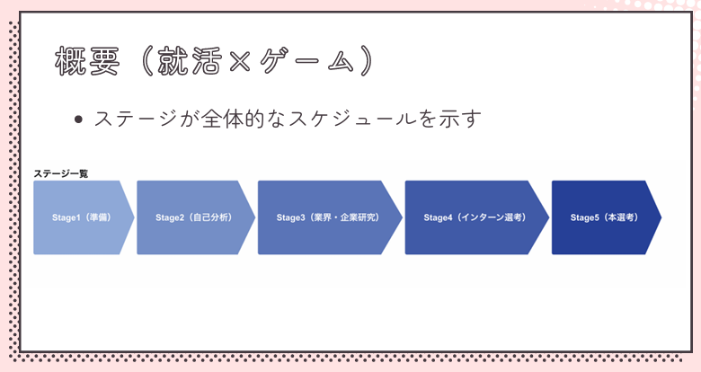
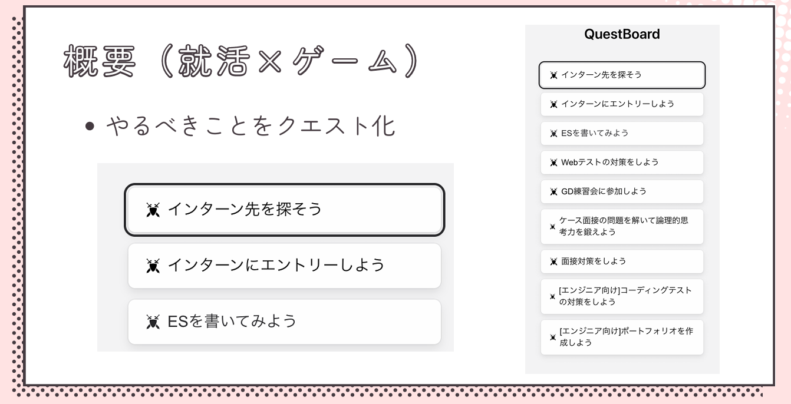
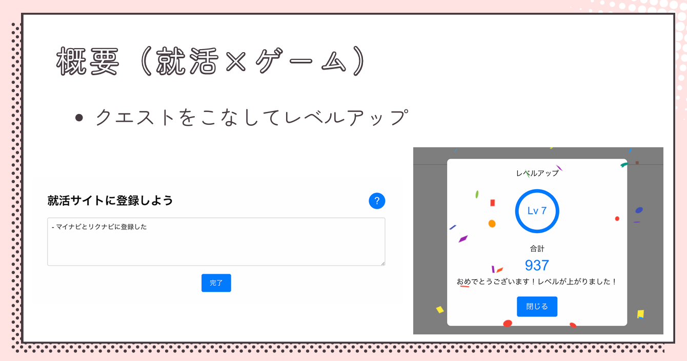
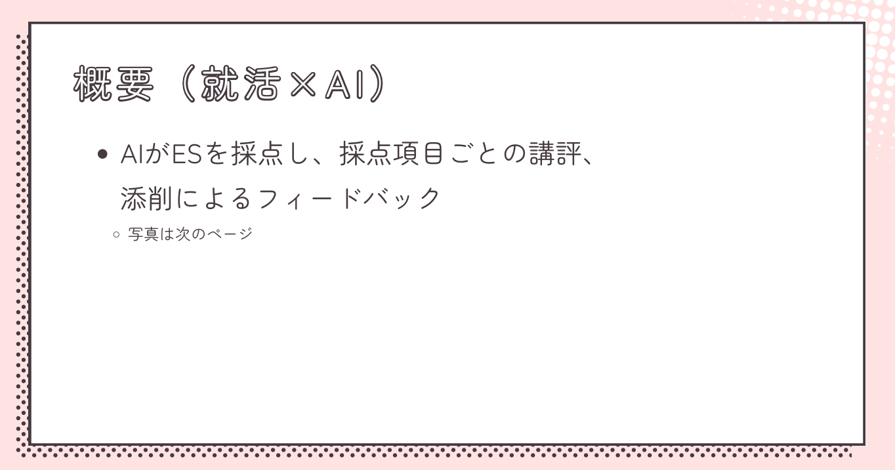
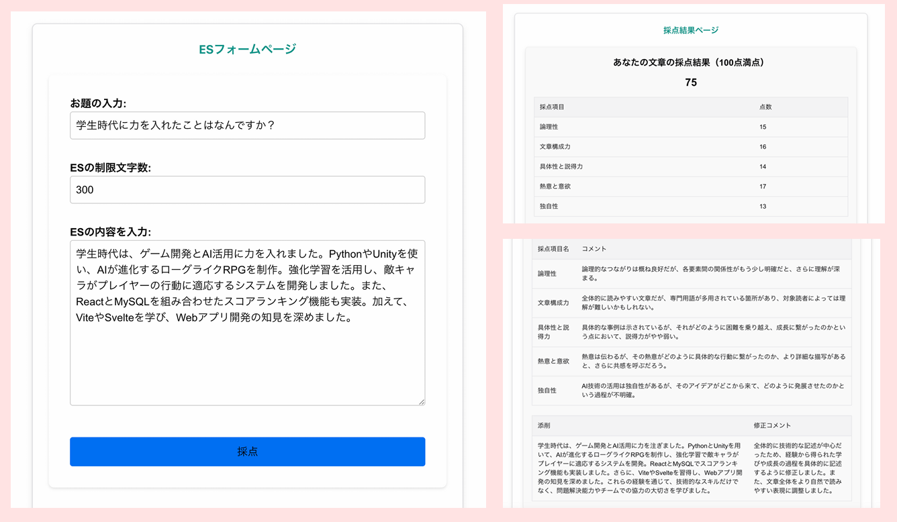
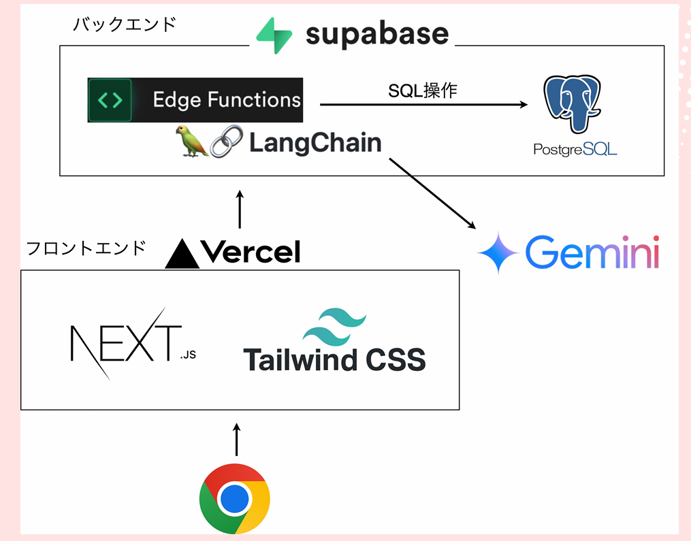

# 就活クエスト

## 概要








## Getting Started

.env.localを作成し、以下の環境変数を設定してください。
```env
NEXT_PUBLIC_BACK_END_API_BASE_URL=https://
NEXT_PUBLIC_GEMINI_API_KEY=
NEXT_PUBLIC_GEMINI_MODEL=gemini-2.0-flash
NEXT_PUBLIC_DB_BASE_URL=https://
NEXT_PUBLIC_DB_API_KEY=
```

```bash
npm install
npm run dev
# or
pnpm install
pnpm run dev
```